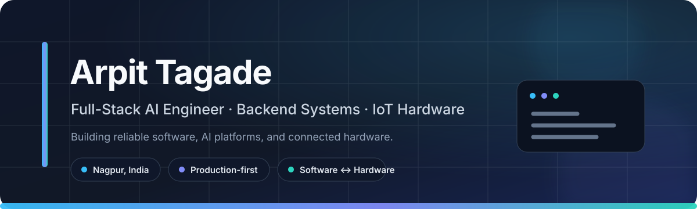

  

  <a href="tagadearpit.vercel.app/">Portfolio</a>
  &nbsp;•&nbsp;
  <a href="https://www.linkedin.com/in/tagadearpit">LinkedIn</a>
  &nbsp;•&nbsp;
  <a href="mailto:arpittagade5@gmail.com">Email</a>
  &nbsp;•&nbsp;
  <a href="https://github.com/tagadearpit?tab=repositories">Repositories</a>

## About

I am a **Full-Stack AI Engineer and hardware developer** based in Nagpur, India, currently pursuing a B.Tech in Artificial Intelligence and Data Science.

I build production-oriented systems across the complete stack—from responsive React and Next.js interfaces to Spring Boot and Node.js services, real-time WebSocket/WebRTC communication, AI orchestration, databases, and ESP32 firmware.

My work is centered on four areas:

- **AI products:** multimodal assistants, memory systems, model integration, and safe server-side orchestration
- **Backend engineering:** secure authentication, persistent sessions, APIs, rate controls, validation, and observability
- **Real-time systems:** messaging, presence, media transfer, signaling, and browser-based audio/video calls
- **Physical computing:** ESP32, Arduino, embedded C/C++, sensors, displays, and cloud-connected robotics

---

## Selected projects

<table>
  <tr>
    <td width="50%" valign="top">
      <h3>Monika AI</h3>
      
<strong>Multimodal AI companion platform</strong>

      

        A full-stack AI application built around Google Gemini with persistent conversations,
        editable memory, image and document inputs, speech features, authentication, session
        management, usage controls, and administrative tooling.
      

      
<strong>Stack:</strong> Node.js, Express, MongoDB, Gemini API, Firebase, JWT

      

        <a href="https://monika-ai-0jpf.onrender.com"><strong>Live application</strong></a>
        &nbsp;·&nbsp;
        <a href="https://github.com/tagadearpit/Monika-AI"><strong>Source</strong></a>
      

    </td>
    <td width="50%" valign="top">
      <h3>Neosis</h3>
      
<strong>Real-time messaging and browser calling platform</strong>

      

        A React and Spring Boot communication platform with persistent chat, contact management,
        authenticated media uploads, read receipts, conversation controls, WebSocket messaging,
        and WebRTC audio/video calling.
      

      
<strong>Stack:</strong> Java, Spring Boot, React, MongoDB, STOMP, WebRTC, OAuth 2.0

      

        <a href="https://neosis-static-site.onrender.com"><strong>Live application</strong></a>
        &nbsp;·&nbsp;
        <a href="https://github.com/tagadearpit/Neosis"><strong>Source</strong></a>
      

    </td>
  </tr>
  <tr>
    <td width="50%" valign="top">
      <h3>Engineering Portfolio</h3>
      
<strong>Responsive portfolio and project showcase</strong>

      

        A clean, responsive Next.js portfolio that presents my engineering work, technical focus,
        project case studies, resume, and an optional server-side Gemini assistant.
      

      
<strong>Stack:</strong> Next.js, React, TypeScript, Tailwind CSS, Vercel

      

        <a href="https://tagadearpit.vercel.app/"><strong>Live portfolio</strong></a>
        &nbsp;·&nbsp;
        <a href="https://github.com/tagadearpit/My-portfolio"><strong>Source</strong></a>
      

    </td>
    <td width="50%" valign="top">
      <h3>CandyRobot</h3>
      
<strong>AI-connected embedded robotics platform</strong>

      

        ESP32 firmware that coordinates servo movement, a 128×64 OLED interface, network-bound AI
        requests, and asynchronous device behavior under real memory, voltage, timing, and thermal constraints.
      

      
<strong>Stack:</strong> ESP32, C++, Arduino, OLED, servo control, Gemini API

      
<strong>Focus:</strong> cloud AI ↔ embedded control ↔ physical interaction

    </td>
  </tr>
</table>

---

## Technical stack

  
### 💻 Languages

### 🎨 Frontend

### ⚙️ Backend & Data

### ☁️ Infrastructure & Hardware

### 🔒 Security

### ⚡ Real-time

---

## Engineering approach

**Production first**  
I design for maintainability, secure defaults, predictable failure handling, and real deployment constraints—not only for a successful demo.

**Security by architecture**  
Authentication, authorization, session lifecycle, validation, CORS/CSRF behavior, secrets, and abuse controls are treated as system design concerns.

**Operational reliability**  
I account for logging, health checks, deployment configuration, dependency reproducibility, resource limits, retries, and graceful degradation.

**Performance with restraint**  
Interfaces should remain responsive on practical devices, real-time systems should control lifecycle and backpressure, and animations should not compromise usability.

---

## Current focus

- Building production-grade AI applications with controlled memory and multimodal input
- Designing secure Java and Node.js backends for long-lived user sessions
- Improving real-time communication systems with WebSockets and WebRTC
- Connecting cloud intelligence with ESP32-based hardware and robotics

---

## Education

**B.Tech in Artificial Intelligence and Data Science**  
Wainganga College of Engineering and Management, Nagpur  
Expected graduation: **2029**

---

## Contact

I am open to engineering discussions, collaboration, internships, and roles involving full-stack development, Java backend systems, applied AI, real-time platforms, or IoT hardware.

  <a href="mailto:arpittagade5@gmail.com"><strong>Email</strong></a>
  &nbsp;•&nbsp;
  <a href="https://www.linkedin.com/in/tagadearpit"><strong>LinkedIn</strong></a>
  &nbsp;•&nbsp;
  <a href="https://my-portfolio-snowy-sigma-18.vercel.app/"><strong>Portfolio</strong></a>
  &nbsp;•&nbsp;
  <a href="https://github.com/tagadearpit"><strong>GitHub</strong></a>

  Building reliable systems across software, AI, and physical hardware.

